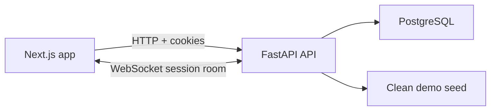
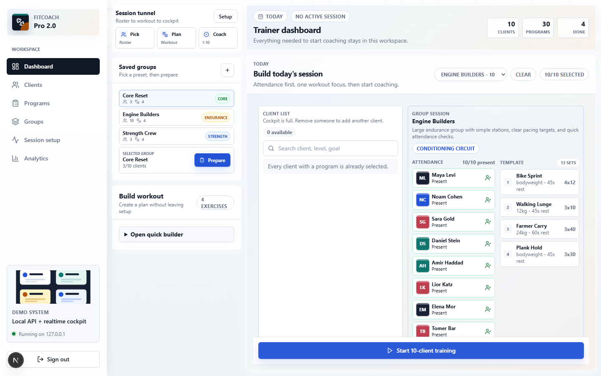
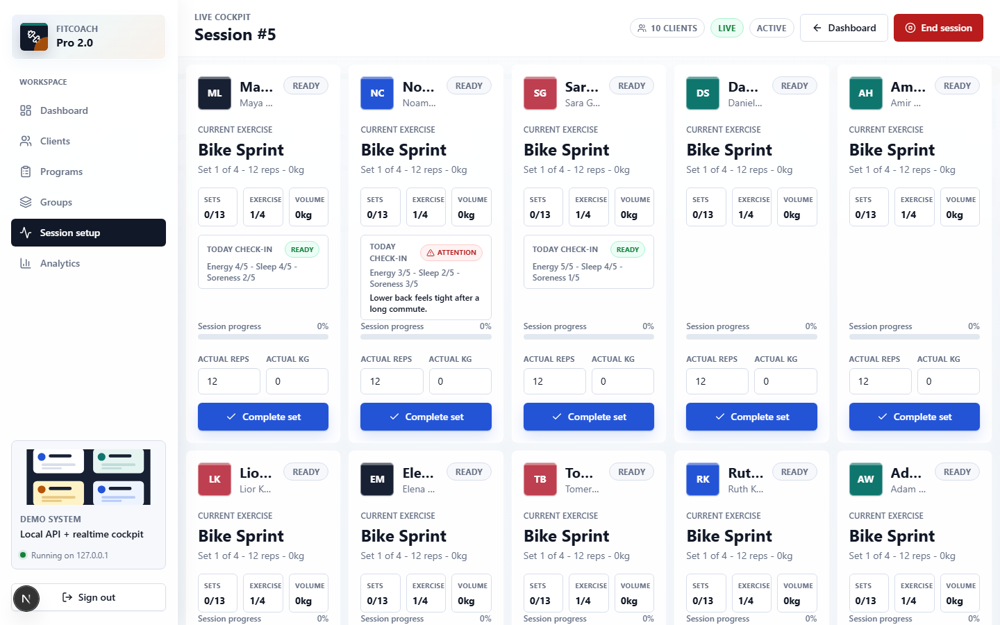
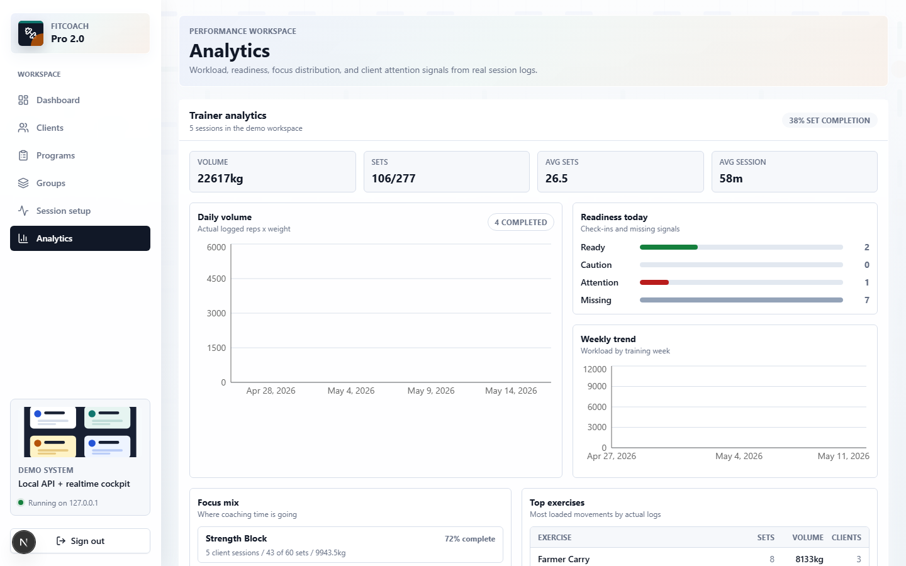

# FitCoach Pro 2.0

FitCoach Pro 2.0 is a production-grade portfolio rebuild of a small-group personal training platform. It helps a trainer manage one to ten clients in one live session while keeping each client's program, progress, rest timer, and workout history separate.

## Product Focus

- Demo trainer login with HttpOnly cookie auth.
- Demo client login with a scoped client training hub.
- Trainer dashboard for clients, programs, active sessions, and recent sessions.
- Saved training groups for recurring strength, endurance, and core sessions with attendance, substitutions, reusable rosters, and exercise templates.
- Client roster management with create, edit, archive, and profile links.
- Session setup for 1-10 selected clients with per-client workout variants.
- Client daily check-in for energy, sleep, soreness, pain notes, and training goal.
- Trainer readiness signals in the roster before the session starts.
- Program builder with ordered exercises, sets, reps, weight, and rest.
- Realtime 1-10 client coach cockpit powered by FastAPI WebSockets.
- Session summary with completed sets, planned sets, volume, coach notes, and next focus.
- Client profile with workout history, active programs, volume trend analytics, exercise breakdown, and completion metrics.
- Client portal with assigned programs, coach notes, next focus, history, and personal analytics.
- Trainer analytics workbench with daily and weekly volume, focus mix, top exercises, readiness mix, client load, and attention flags.
- Responsive web shell with desktop sidebar and mobile bottom navigation.
- PostgreSQL-first backend with SQLAlchemy 2, Alembic, Pydantic, and pytest.
- Next.js App Router frontend with TypeScript, Tailwind, TanStack Query, and Recharts analytics.

## Demo Credentials

Trainer:

```text
trainer@fitcoach.dev
demo-password
```

Client:

```text
maya@fitcoach.dev
demo-password
```

## Architecture



## Screenshots

Trainer session setup with saved groups and a 10-client session limit:



Realtime coach cockpit for a full 10-client small-group session:



Trainer analytics workspace built from completed session logs:



## Fast Local Setup

This is the recommended path for someone who downloads the repo and wants to see the product quickly. It uses a local SQLite demo database, so Docker and Postgres are not required.

```powershell
npm run setup:local
npm run start:local
```

Open `http://127.0.0.1:3000/login` and use the demo credentials above.

Useful local commands:

```powershell
npm run start:local:reset
npm run quality:fast
npm run quality
```

`setup:local` creates missing `.env` files, installs dependencies, runs Alembic migrations, and seeds a clean demo workspace. Existing `.env` files are not overwritten.

`start:local` starts the FastAPI backend and Next.js frontend in the background and writes logs to `.codex/logs/`.

## Production-Like Postgres Setup

```bash
docker compose up -d db

cd backend
python -m venv .venv
.venv\Scripts\activate
pip install -r requirements.txt
copy .env.example .env
alembic upgrade head
python -m app.seed --reset-demo
uvicorn app.main:app --reload --port 8000
```

```bash
cd frontend
npm install
copy .env.example .env.local
npm run dev
```

Open `http://localhost:3000/login` and use the demo credentials above.

Use `python -m app.seed` for non-destructive seeding. Use `python -m app.seed --reset-demo` before portfolio demos or e2e runs when you want to remove local demo mutations and rebuild the curated roster, check-ins, programs, and workout history.

For a Postgres-backed one-command setup, use:

```powershell
npm run setup:local:postgres
```

## Mobile Status

FitCoach Pro is a responsive web app, not a native mobile app. The current mobile version includes a compact top bar, bottom navigation, and responsive client/profile/analytics views. The live 1-10 person cockpit remains best on tablet or desktop because a trainer needs to see multiple clients, timers, and logging controls at once.

## Tests

Run the local project gate from the repository root:

```powershell
npm run quality:fast
npm run quality
```

Or run checks by area:

```bash
cd backend
pytest
```

```bash
cd frontend
npm run lint
npm run typecheck
npm run test
npm run build
npm run e2e
```

The full gate is documented in `docs/QUALITY_GATE.md`. Pull requests should use `.github/pull_request_template.md` and keep SDD, ADR, QA, and risk docs current.

Before publishing the project publicly, use `docs/PUBLISH_CHECKLIST.md` to verify repository hygiene, screenshots, demo reset, and git remote setup.

## Deployment Notes

- Frontend: Vercel, using `NEXT_PUBLIC_API_URL` and `NEXT_PUBLIC_WS_URL`.
- Backend: Render Web Service running `uvicorn app.main:app --host 0.0.0.0 --port $PORT`.
- Database: Render Postgres or Supabase Postgres via the same `DATABASE_URL`.
- Set `ENVIRONMENT=production`, `SECURE_COOKIES=true`, and `FRONTEND_ORIGIN` to the deployed frontend URL.
- Keep browser, API, and WebSocket cookie scope aligned in production; local WebSocket URLs automatically match `localhost` vs `127.0.0.1` so demo cookies reach the cockpit.

## What I Would Improve Next

- Add a short recorded demo GIF after deploying the public URL.
- Add a dedicated mobile cockpit review pass for small phones.
- Add Redis-backed WebSocket fanout for multi-instance backend deployment.
- Add richer program adherence filters and date-range controls.
- Add notification/reminder workflow for clients who have not checked in before a session.
- Use `docs/FITCOACH_FUNCTIONAL_QA_AGENT.md` as the product QA contract before each new iteration.
- Add an opt-in AI program assistant only after strict validation rules are in place.
