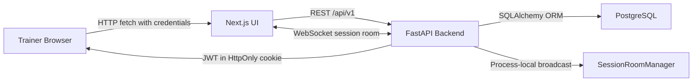

# FitCoach Pro 2.0 System Map

## Purpose

FitCoach Pro 2.0 is a portfolio-grade trainer operations app for managing one-to-ten clients in a live coaching session. The system centers on trainer authentication, client/program management, realtime session execution, session summaries, and lightweight analytics.

## Runtime Units

- Browser UI: Next.js App Router app in `frontend/`.
- API service: FastAPI app in `backend/`.
- Database: PostgreSQL for local and production use, with SQLite used by tests where configured.
- Realtime layer: FastAPI WebSocket endpoint backed by an in-memory room manager.
- Demo seed: idempotent backend seed command in `backend/app/seed.py`.

## Key Modules

Frontend:

- `frontend/src/app/login/page.tsx`: demo trainer login.
- `frontend/src/app/(app)/dashboard/page.tsx`: dashboard shell.
- `frontend/src/app/(app)/sessions/[sessionId]/page.tsx`: live cockpit route.
- `frontend/src/components/dashboard/start-session-panel.tsx`: trainer session setup.
- `frontend/src/components/dashboard/session-setup-model.ts`: pure session setup selection rules and labels.
- `frontend/src/components/cockpit/cockpit-grid.tsx`: realtime cockpit state and actions.
- `frontend/src/components/programs/program-builder.tsx`: quick program creation.
- `frontend/src/components/programs/program-editor.tsx`: read-first program view and edit mode.
- `frontend/src/components/sessions/session-summary-view.tsx`: post-session review.
- `frontend/src/components/clients/client-profile-view.tsx`: client history and analytics.
- `frontend/src/lib/api.ts`: typed frontend API facade.
- `frontend/src/lib/http.ts`: fetch wrapper, credentials, timeout, and API errors.
- `frontend/src/lib/types.ts`: frontend response contracts.

Backend:

- `backend/app/main.py`: FastAPI app, CORS, lifespan, health route, router registration.
- `backend/app/config.py`: environment-driven settings.
- `backend/app/database.py`: SQLAlchemy engine/session setup.
- `backend/app/auth.py`: bcrypt verification, JWT creation/validation, role dependencies.
- `backend/app/models.py`: SQLAlchemy domain model.
- `backend/app/schemas.py`: Pydantic request/response schemas.
- `backend/app/serializers.py`: ORM-to-response aggregation and summary calculations.
- `backend/app/realtime.py`: process-local WebSocket room manager.
- `backend/app/routers/*.py`: HTTP and WebSocket route boundaries.
- `backend/app/services/session_service.py`: session state transitions, logging, undo, and completion rules.

## Context Diagram

## Main Data Flow

Authentication:

1. Trainer submits credentials from `/login`.
2. Frontend calls `POST /api/v1/auth/login`.
3. Backend verifies password, creates an HS256 JWT, and sets `fitcoach_token` as an HttpOnly cookie.
4. Frontend requests use `credentials: "include"`.
5. Protected routes resolve current user through backend auth dependencies.

Dashboard and setup:

1. Dashboard queries `GET /api/v1/dashboard`.
2. Supporting panels query clients, programs, exercises, and trainer analytics.
3. Trainer selects one to ten clients and matching programs.
4. Frontend calls `POST /api/v1/sessions`.
5. Backend validates ownership, capacity, uniqueness, and program/client compatibility.

Live session:

1. Cockpit queries `GET /api/v1/sessions/{sessionId}`.
2. Cockpit opens `WS /api/v1/sessions/ws/{sessionId}`.
3. User actions call session mutation endpoints.
4. Backend writes `session_clients` and `workout_logs`, serializes the full session, and broadcasts the new state.
5. Frontend updates local state and TanStack Query cache from the WebSocket payload.

Summary and history:

1. Summary page queries `GET /api/v1/sessions/{sessionId}/summary`.
2. Backend derives planned sets, completed sets, volume, duration, and exercise summaries.
3. Trainer saves notes through `PATCH /api/v1/sessions/{sessionId}/clients/{clientId}/summary`.
4. Client profile queries `GET /api/v1/clients/{clientId}` for programs, recent sessions, and analytics.

## Data Model

- `users`: trainer and future trainee identities.
- `clients`: trainer-owned client profiles.
- `exercises`: seed exercise library.
- `programs`: reusable client programs with explicit workout focus.
- `program_exercises`: ordered exercise prescription rows.
- `sessions`: live or completed training event.
- `session_clients`: per-client live state, notes, next focus, and status.
- `workout_logs`: completed set records tied to a concrete program exercise occurrence for accurate duplicate-exercise logging.

## Trust Boundaries

- Browser to API: all protected HTTP requests depend on HttpOnly cookie auth and backend ownership checks.
- Browser to WebSocket: enforces equivalent cookie/JWT, allowed `Origin`, and trainer session ownership checks before joining a room.
- API to database: SQLAlchemy ORM is the persistence boundary.
- Public demo credentials: must expose only synthetic demo data.
- Production configuration: secrets and exact origins are environment-owned, not committed.

## External Dependencies

- Vercel for intended frontend deployment.
- Render Web Service for intended backend deployment.
- Render Postgres or Supabase Postgres for intended production database.
- GitHub Actions for active CI.
- npm and PyPI dependency ecosystems.

## Architectural Risks

- WebSocket room joins are auth/ownership/origin checked; e2e must assert the cockpit reaches `live` to prevent cookie host regressions.
- In-memory realtime rooms work only in a single backend process.
- Startup `Base.metadata.create_all()` is convenient locally but should not replace Alembic migrations in production.
- Frontend TypeScript response types can drift from Pydantic schemas; critical fields are covered by an OpenAPI contract guard.
- Query-time analytics are correct for portfolio scale but may need projections if data volume grows.

## Ownership

- Product workflow contract: `docs/FITCOACH_FUNCTIONAL_QA_AGENT.md`.
- Domain stories: `docs/FITCOACH_TRAINER_STORIES_AGENT.md`.
- UX review: `docs/FITCOACH_UX_DESIGNER_AGENT.md`.
- SDD and architecture docs: `docs/sdd/`, `docs/architecture/`.
- Project operating agents: `.codex/agents/`.
